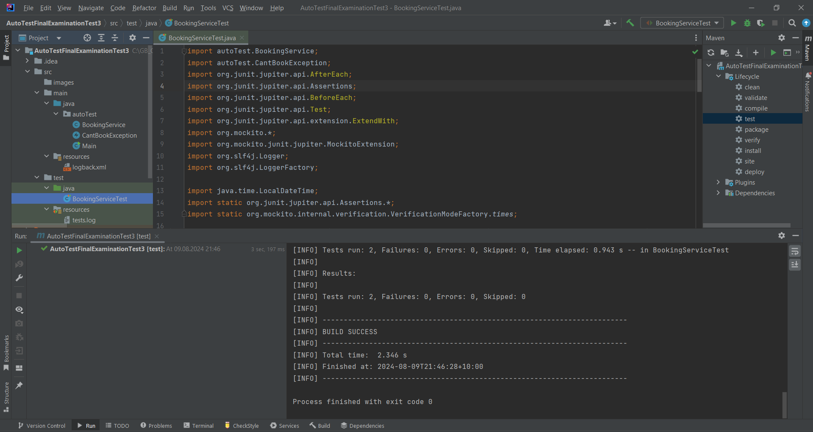
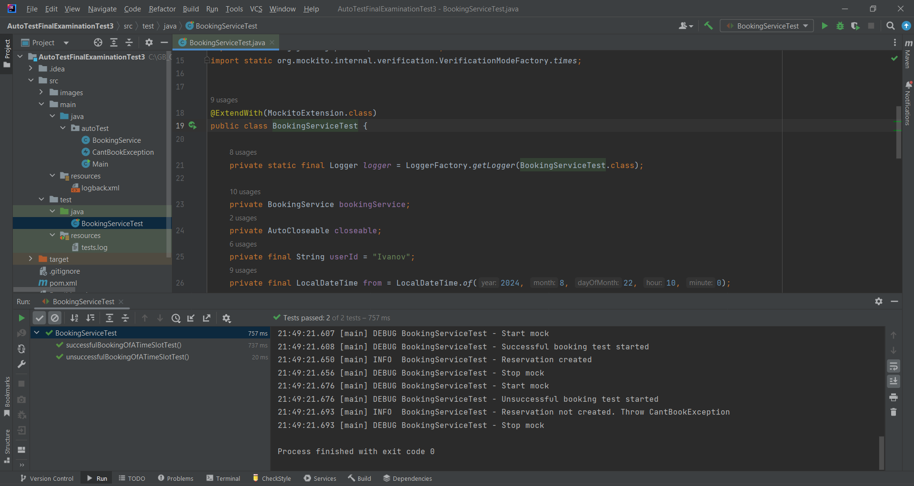

# Задание №3

Цель задания:
Проверить ваши знания по работе с mock объектами
Проверить ваше умение на практике создавать mock объекты
Формулировка задачи:
В блоке main вам дан сервис бронирования (запись на прием) - BookingService. Два метода не реализованы:

Метод проверки занятости слота времени в СУБД
Метод бронирование слота времени
Воспользуйтесь механизмами мокирования и напишите два теста (позитивный и негативный). Добавьте логи

Все необходимые библиотеки уже подключены в pom.xml

=====================================================================================

## Test Run:

---------------------------------------------------------------

## Test Log:
